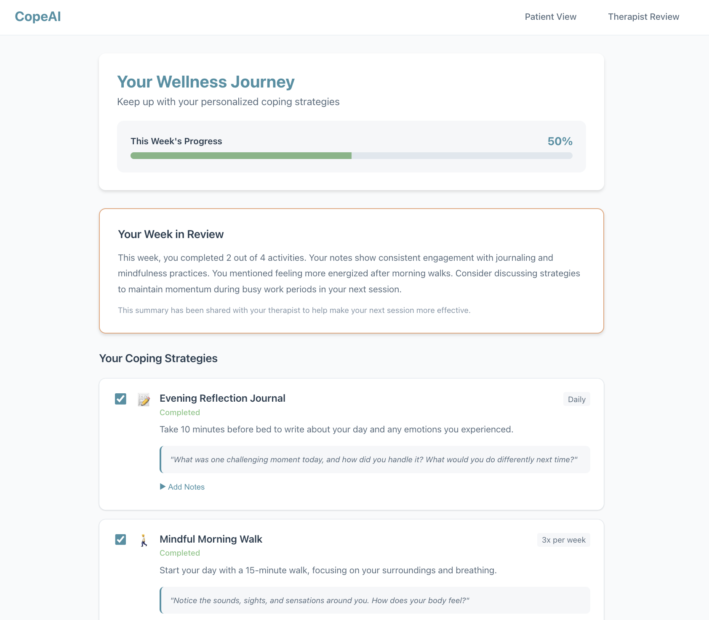

# CopeAI - Healthcare Therapy Companion App

## Overview

Have you ever ended a therapy session with amazing momentum and insights, only to return to the busy day-to-day of your life, and lose touch with the progress and discoveries you've made by your next session?

**CopeAI** addresses the critical gap between discussing coping strategies in therapy and applying them in daily life. Our full-stack healthcare application uses GenAI to analyze therapy session transcripts and generate personalized, actionable reminders with therapist-recommended coping strategies, like journaling, mindfulness exercises, and breathing techniques. This keeps patients engaged with their progress between sessions, and their responses are synthesized into a pre-session summary for the therapist, making future appointments more effective.



### The Problem

Patients often leave therapy sessions with valuable insights and coping strategies, but struggle to maintain momentum in their daily lives. The disconnect between weekly sessions can lead to:

- Lost progress and forgotten techniques
- Reduced engagement with therapeutic practices
- Less effective follow-up sessions
- Difficulty tracking what works and what doesn't

### Our Solution

CopeAI creates a continuous care loop:

1. **AI-Powered Analysis** - Automatically analyzes therapy transcripts to identify key themes and recommended strategies
2. **Therapist Oversight** - Clinicians review and approve personalized plans before deployment
3. **Patient Engagement** - Timely reminders and guided prompts keep patients connected to their progress
4. **Data-Driven Insights** - Weekly summaries help both patients and therapists understand what's working

## Project Structure

```
.
├── frontend/                    # React application
│   ├── src/
│   │   ├── components/         # Reusable React components
│   │   │   └── SuggestionBox.js
│   │   ├── pages/              # Page components
│   │   │   ├── TreatmentPlanPage.js   # Therapist review interface
│   │   │   └── UserPlanPage.js        # Patient wellness journey
│   │   ├── styles/             # Organized SCSS stylesheets
│   │   │   ├── _variables.scss        # Theme variables
│   │   │   ├── App.scss               # Main app and navigation styles
│   │   │   ├── SuggestionBox.scss     # Component styles
│   │   │   ├── TreatmentPlanPage.scss # Therapist view styles
│   │   │   └── UserPlanPage.scss      # Patient view styles
│   │   ├── theme.js            # Healthcare-friendly design system (JS object)
│   │   └── App.js              # Main application with routing
│   └── package.json
└── backend/                     # Flask API server
    ├── app.py                  # REST API with treatment plan endpoints
    └── requirements.txt
```

## Prerequisites

- Node.js (v14 or higher)
- Python 3.8+
- npm or yarn

## Setup Instructions

### Backend Setup

1. Navigate to the backend directory:

```bash
cd backend
```

2. Create a virtual environment:

```bash
python3 -m venv venv
```

3. Activate the virtual environment:

- On macOS/Linux:

```bash
source venv/bin/activate
```

- On Windows:

```bash
venv\Scripts\activate
```

4. Install Python dependencies:

```bash
pip install -r requirements.txt
```

5. Run the Flask server:

```bash
python app.py
```

The backend server will start on `http://localhost:5001`

### Frontend Setup

1. Navigate to the frontend directory:

```bash
cd frontend
```

2. Install dependencies:

```bash
npm install
```

3. Start the development server:

```bash
npm start
```

The React app will open in your browser at `http://localhost:3000`

## User Journey

1. **Transcription & AI Analysis** - After a therapy session, the transcript is analyzed by GenAI to generate a personalized treatment plan
2. **Provider Review** - Therapist receives notification to review and approve the AI-generated coping strategies
3. **Patient Engagement** - Approved plans are sent to patients with scheduled reminders throughout the week
4. **Progress Tracking** - Patients complete activities and add reflective notes
5. **Weekly Summary** - AI generates a summary of patient progress for both patient and therapist before the next session

## API Endpoints

### Treatment Plan Endpoints (Therapist)

- `GET /api/treatment-plan/pending` - Get pending treatment plans for review
- `POST /api/treatment-plan/approve` - Approve and activate a treatment plan
- `POST /api/treatment-plan/revise` - Request AI revision of treatment plan
- `POST /api/treatment-plan/parse-transcript` - Generate plan from therapy transcript (GenAI integration point)

### User Plan Endpoints (Patient)

- `GET /api/user-plan/current` - Get patient's current active wellness plan
- `POST /api/user-plan/update-activity` - Update activity status and add notes
- `GET /api/user-plan/summary` - Get AI-generated weekly progress summary

### Notification Endpoints (Twilio Integration)

- `POST /api/notifications/send` - Send notification to patient
- `POST /api/notifications/schedule` - Schedule recurring notifications for a treatment plan

### Demo Management

- `POST /api/demo/reset` - Reset all demo data to initial state (clears and reinitializes sample data)

### Legacy Endpoints

- `GET /api/hello` - Health check
- `GET /api/data` - Sample data
- `POST /api/echo` - Echo test

## Features

### Frontend

- **Healthcare-friendly Design System** - Calming colors, accessible typography, thoughtful spacing
- **Organized SCSS Architecture** - BEM methodology with component-scoped stylesheets and centralized variables
- **Component Architecture** - Reusable SuggestionBox component shared between views
- **Two Main Views**:
  - **TreatmentPlanPage** - Therapist interface for reviewing and approving AI-generated plans
  - **UserPlanPage** - Patient interface for tracking wellness activities and progress
- **React Router** - Seamless navigation between patient and therapist views
- **Real-time Progress Tracking** - Visual progress bars and completion rates
- **Interactive Notes** - Patients can reflect on activities, therapists can review insights
- **Demo Reset Feature** - One-click button to reset the entire demo state for presentations

### Backend

- **RESTful API** - Clean separation of concerns with dedicated endpoint groups
- **In-memory Demo Data** - Pre-populated sample treatment and user plans
- **GenAI Integration Points** - Endpoints ready for AI transcript analysis and summary generation
- **Activity Logging** - Tracks all patient interactions for analysis
- **Flexible Data Models** - Supports multiple activity types (journaling, exercise, breathing, custom)

## Development

### Running Both Servers

You'll need two terminal windows:

Terminal 1 (Backend):

```bash
cd backend
source venv/bin/activate  # On macOS/Linux
python app.py
```

Terminal 2 (Frontend):

```bash
cd frontend
npm start
```

## Technologies Used

### Frontend

- React 19
- React Router DOM
- SCSS/Sass - Organized stylesheets with BEM methodology
- JavaScript (ES6+)
- Fetch API for backend communication
- Custom theme system with healthcare-focused design

### Backend

- Python 3.12
- Flask - Web framework
- Flask-CORS - Cross-origin resource sharing
- UUID - Unique identifiers for entities

## Demo Data

The application comes pre-loaded with sample data to demonstrate the full user journey:

- **Sample Treatment Plan** - A pending plan for "Sarah Johnson" with 4 coping strategies
- **Sample User Plan** - An active plan showing various completion states and patient notes
- **Sample Week Summary** - AI-generated insights based on patient activity

### Demo Mode - Reset Feature

For hackathon presentations and demos, CopeAI includes a convenient **"Reset Demo"** button in the navigation bar:

1. Click the **🔄 Reset Demo** button in the top right
2. Confirm the reset action
3. All data is cleared and regenerated with fresh sample data
4. You're automatically redirected to the Therapist Review page to start the journey

This allows you to:

- Demonstrate the complete user journey from the beginning
- Show the therapist approval workflow
- Reset after making changes during the demo
- Quickly get back to a clean state for multiple presentations

**What gets reset:**

- All treatment plans (creates new pending plan for review)
- All user plans (creates new active plan with sample progress)
- All activity logs (clears interaction history)

## Future Enhancements

- [ ] GenAI integration for transcript analysis (OpenAI/Anthropic)
- [ ] Twilio SMS notifications for patient reminders
- [ ] User authentication and authorization
- [ ] Database integration (PostgreSQL/MongoDB)
- [ ] Scheduling system for automated reminders
- [ ] Analytics dashboard for therapists
- [ ] Mobile-responsive improvements
- [ ] Accessibility enhancements (WCAG compliance)
